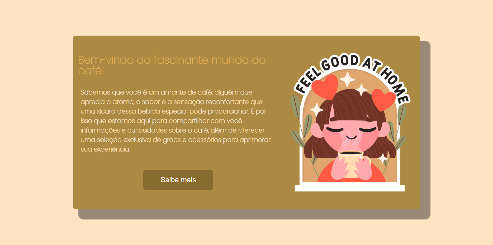

<h1 align="center"> Land Page </h1>

    Uma simples land page sobre café 

  <a href="#-tecnologias">Tecnologias</a>&nbsp;&nbsp;&nbsp;|&nbsp;&nbsp;&nbsp;
  <a href="#-projeto">Projeto</a>&nbsp;&nbsp;&nbsp;|&nbsp;&nbsp;&nbsp;  
  <a href="#memo-licença">Licença</a>

  

 

  

## 🚀 Tecnologias

Esse projeto foi desenvolvido com as seguintes tecnologias:

- HTML e CSS

## 💻 Projeto

Esse projetinho foi feito apenas para testar alguns conhecimentos meus sobre front-end e design, testei alguns sites de design para criar fonte e paletas de cores no projeto
## :memo: Licença

Esse projeto está sob a licença MIT.

---

